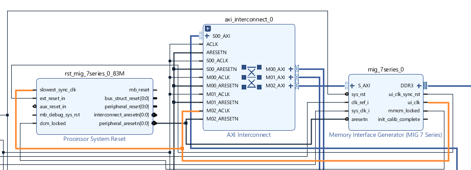

# MIG を使うのが難しかったところ

### 端子をケチっているのの対応

何本かの端子が使われていない為の MIG の設定

### クロック設定

DDRメモリ用のクロック

AXI のクロック (ui_clk) はこの 1/4 の周波数になる。

sys_clk_i に入力する参照用のクロック

clk_ref_i とは別らしいがなんで？

### クロック入力

clk_ref_i は 200MHz クロックを、sys_clk_i は先ほど設定した167MHz を入力する。

### クロック出力

ui_clk は先ほどの通り 333MHz の 1/4 の 83MHz になる。これを S_AXI 用のクロックに使う。